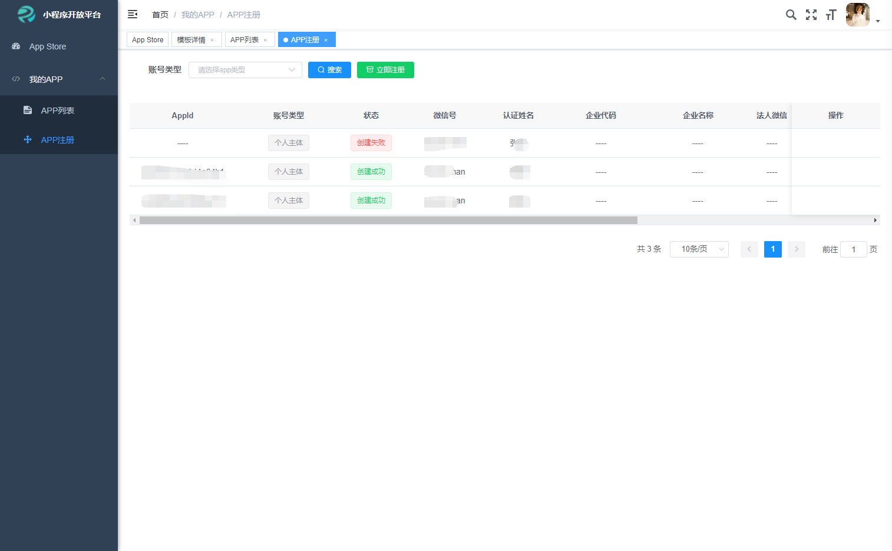
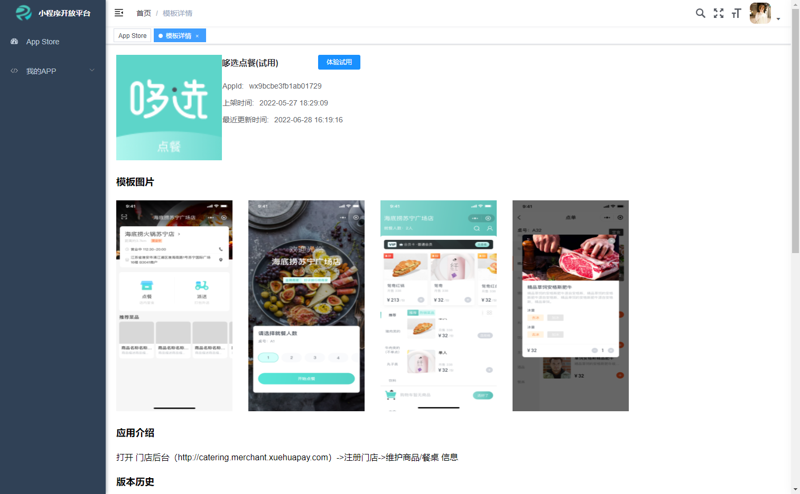

# 微信小程序第三方平台

#### 介绍
由于微信第三方平台开发微信小程序只提供代码草稿上传与模板设置，不提供版本管理，官方推荐go语言demo和微信云服务，鉴于此，我们研发了一套微信第三方平台小程序与模板管理平台，附加模板市场，减免开发时长，以提供给有需求的人使用。我们提供小程序模板市场，小程序代注册，第三方平台APP绑定，模板上传，小程序管理，小程序版本管理。体验地址：https://wx-third-platform.kapakeji.com/#/appStore

平台用户分为普通用户与商户。

##### 普通用户功能：
- 注册小程序，然后通过微信认证与完善小程序信息，
- 模板市场中。查询自己所需要的模板，然后通过授权与安装到自己的小程序中进行体验
- 小程序托管。将自己的小程序托管给提供模板的商户进行代运营。

##### 商户功能：
- 平台注册小程序与代理用户注册小程序，然后到小程序注册的主体微信中进行微信认证与完善小程序
- 新增第三方平台APP。此APP可当作模板，放入模板市场，以提供给普通用户进行授权安装使用，也可以此来推广自己的小程序产品
- 代管理用户托管给模板APP商户的小程序，维护小程序信息，版本管理
- 管理模板所绑定的小程序

#### 使用说明

##### 普通用户
1. 注册普通账号
2. 注册小程序
3. APP Store 找到自己需要的模板
4. 点击试用
5. 通过小程序管理员扫描授权二维码
6. 输入小程序名称或者appid查询到自己的小程序
7. 点击下一步，微信扫码体验
8. 可进入自己的APP列表中对小程序进行更多操作，如：修改小程序信息，生成体验二维码，管理小程序体验用户，小程序托管给商户

##### 商户用户
1.  注册商户账号
2.  绑定第三方平台App信息，需要到微信开发者平台中获取相关信息填入系统中
3.  新增第三方平台所绑定的小程序信息，如果没有则需要到APP注册中，通过平台代注册小程序，然后使用微信认证小程序后，平台会收到微信认证成功的小程序消息，自动绑定到第三方平台所绑定的小程序列表中
4.  通过小程序开发者工具上传小程序模板到草稿中
5.  将草稿设置成模板
6.  将模板上传到所需要的小程序中
7.  然后到小程序列表中进行小程序的版本管理，上架

#### 技术讨论
##### 源码属公司所有，暂不开放，如果需求欢迎讨论与商务洽谈 

#### 图片

#### 软件架构
| 技术                   | 版本   | 说明                                    |
| ---------------------- | ------ | --------------------------------------- |
| Spring Boot            | 2.1.6  | MVC核心框架                             |
| Spring Security  | 2.1.5  | 认证和授权框架                          |
| MyBatis                | 3.5.0  | ORM框架                                 |
| MyBatisPlus            | 3.1.0  | 基于mybatis，使用lambda表达式的         |
| Knife4j             | 2.9.2  | 文档生产工具                            |
| redisson               | 3.10.6 | 对redis进行封装、集成分布式锁等         |
| hikari                 | 3.2.0  | 数据库连接池                            |
| logback                 | 2.11.2 | 更快的log日志工具                       |
| lombok                 | 1.18.8 | 简化对象封装工具                        |
| hutool                 | 4.5.0  | 更适合国人的java工具集                  |

#### 参与贡献

1.  WxJava 
